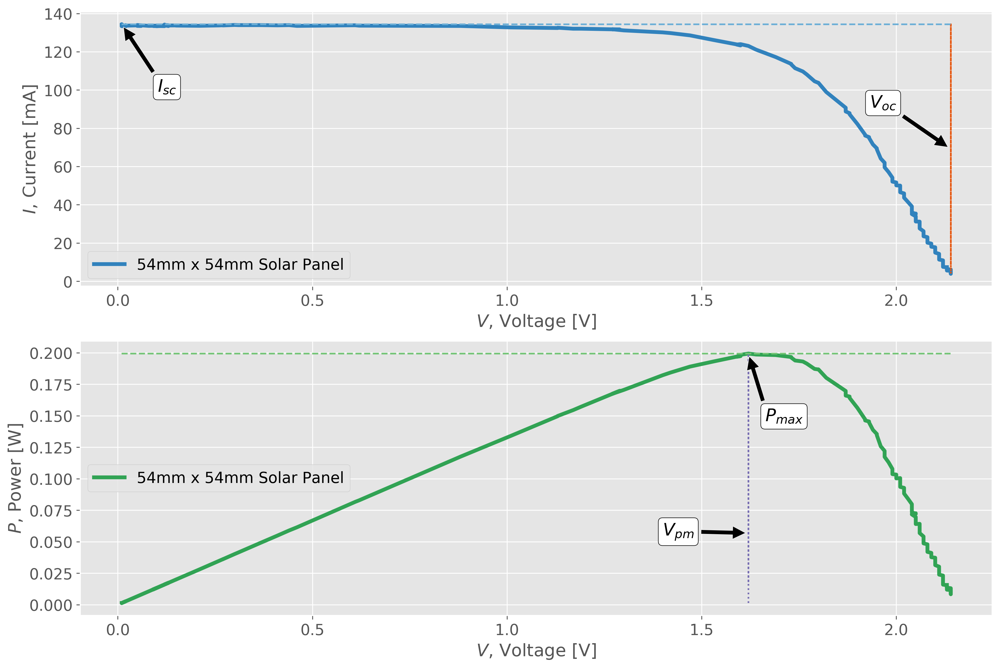

# Solar Panel Characterization with Arduino
Solar panel characterization with Arduino, with data analyses in Python.

Get your Solar Panel Datalogger Kit: [Solar Panel Datalogger Kit for Arduino](https://makersportal.com/shop/solar-panel-datalogger-kit-for-arduino)  
See full tutorial here: [Solar Panel Characterization and Experiments with Arduino](https://makersportal.com/blog/solar-panel-characterization-and-experiments-with-arduino)  

# 
### JUMP TO:
<a href="#wiring">- Wiring Diagram</a> 
<a href="#arduino">- Arduino Code Usage</a> 
<a href="#python">- Arduino Code Usage</a> 
<a href="#results">- Example Output Plots</a> 

The TinyBlueX library can be downloaded using git:

    git clone https://github.com/makerportal/solar-char

# - Wiring Diagram for Solar Datalogging-

The wiring between the components and the Arduino BLE-Nano board is given below:

Note: we have omitted any explanation of the wiring configuration in order to declutter the tutorial, however, most of the wiring explanations can be found either on our site or in other literature/forums online. We will discuss the solar panel, potentiometer (rheostat), and INA226 current/voltage configuration later in the experimental setup section. The rest are left for the user to explore.

# - Arduino -

We first need to characterize the panel’s output range to find the optimal operating voltage. We do this by turning the rheostat (potentiometer) from minimum to maximum in order to vary the load on the solar panel. First, the Arduino code that logs and prints voltage and current must be uploaded to the microcontroller. In our case, we’re using the BLE-Nano, which acts similar to the Arduino Nano and Uno boards (ATmega328P at the center). 

The code used to log and print voltage and current is given at the following code under the arduino folder:

- [solar_rheostat.ino](/arduino/solar_rheostat.ino)

For the long-term experiment, we left the entire box outside for a day with the solar panel mounted atop the box. The panel was pointed slightly east at an angle less than 15° (due to the slight opening of the box), but mostly vertical to ensure the highest power output. The box was left outside from 8:00 a.m. June 15th, 2021 until roughly 9:00 a.m. June 16th, 2021 in northeastern San Francisco, CA. Data points were acquired roughly every 60 seconds, based on the longterm Arduino code called:

- [solar_longterm.ino](/arduino/solar_longterm.ino)
    

# - Python -

Identification of the panel's nominal open-circuit voltage, short-circuit current, max power voltage and current, and max power output can be conducted via the Python rheostat analysis code:

- [python_rheostat.py](/python/python_rheostat.py)

After retrieving the kit after an entire day’s worth of datalogging, we can then use the Python 3 script for the diurnal analysis:

- [python_rheostat.py](/python/python_rheostat.py)

# - Results -

The rheostat analysis output plot can be seen below: 

In the plot below, we plot the raw time-series plot of the power output from the solar panel:

